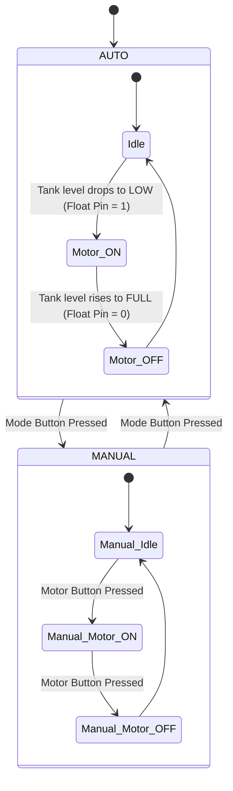

# 🚰 Water Tank Controller - System Documentation & Integration Guide

Welcome to the comprehensive documentation guide for the Arduino-based Water Tank Controller. This document covers system architecture, wiring diagrams, detailed logic flows, software debouncing mechanisms, and physical installation recommendations for noise mitigation.

---

## 🔌 1. Circuit Connections & Pinout

Ensure all low-voltage signal lines (OLED, buttons, and sensor) are routed away from high-voltage AC wires going to the pump motor to minimize induction noise.

```
                  +-----------------------------------+
                  |            ARDUINO UNO            |
                  |                                   |
    [Float Switch] | D2                           A4   | ----> OLED SDA
      [Mode Button] | D3                           A5   | ----> OLED SCL
     [Motor Button] | D4                                |
                  |                                   |
        [Blue LED] | D6                                |
       [Green LED] | D7                                |
                  | D8                                | ----> Relay Module IN
                  +-----------------------------------+
```

### Pin Connectivity Table
| Terminal Pin | Device | Signal Connection | Description |
| :---: | :--- | :---: | :--- |
| **D2** | Float Switch | Input (Internal Pull-Up) | Detects water level. Closed/Low = Tank FULL, Open/High = Tank LOW. |
| **D3** | Mode Button | Input (Internal Pull-Up) | Momentary button to toggle AUTO / MANUAL modes. |
| **D4** | Motor Button | Input (Internal Pull-Up) | Momentary button to toggle Motor ON / OFF (Manual Mode only). |
| **D6** | Blue LED | Output (Active High) | Indicator LED showing manual motor activation. |
| **D7** | Green LED | Output (Active High) | Indicator LED showing MANUAL mode override is active. |
| **D8** | Relay Pin | Output (Active High) | Control line to trigger the relay. High = RELAY_ON, Low = RELAY_OFF. |
| **A4** | 128x64 OLED | I2C SDA (Data Line) | Pulls display data; utilizes the hardware Wire interface. |
| **A5** | 128x64 OLED | I2C SCL (Clock Line) | Synchronizes communication clock. |

---

## ⚙️ 2. Control Logic Architecture

The controller implements a robust state machine that transitions between automatic sensor-driven regulation and user manual controls.



### Detailed Logic Breakdown
1.  **AUTO Mode (Automatic Regulation)**:
    - Default state at boot.
    - Monitors the debounced float switch state (`floatStableState`).
    - If `floatStableState == HIGH` (meaning float is hanging down, water is low), `motorState` is set to `true`.
    - If `floatStableState == LOW` (meaning float is floating up, water is full), `motorState` is set to `false`.
2.  **MANUAL Mode (Override Controls)**:
    - User presses the Mode button to transition to MANUAL. The Green LED lights up.
    - In MANUAL mode, the float switch continues to update on the display but **does not affect the motor**.
    - User toggles the motor state by pressing the Motor button. The Blue LED reflects the motor state.

---

## ⚡ 3. Software Noise & EMI Mitigation

In industrial and home automation environments, AC induction motors present high inductive reactance. When the relay cuts off power to the pump:
- The sudden collapse of the motor's magnetic field creates a high-voltage spike (back-EMF).
- This back-EMF sparks across the relay contacts, acting as a small radio transmitter (EMI).
- This EMI is picked up by the Arduino's input pins, causing transient voltage drops that look like a physical button press (brief `LOW` transitions).

Our software addresses these electrical issues:

### A. Non-Blocking Button Debounce
Transient noise pulses typically last under 2 milliseconds. The sketch implements a timer-based verification:
```cpp
if (rawModeBtn != lastModeBtnReading) {
  lastModeBtnTime = currentMillis;
}
if ((currentMillis - lastModeBtnTime) > DEBOUNCE_DELAY) {
  if (rawModeBtn != modeBtnStableState) {
     // Trigger State Change
  }
}
```
Only button inputs that remain stable for a full `50 milliseconds` are registered, filtering out all high-frequency electrical pulses.

### B. Float Switch Turbulence Filter
Water coming out of the inlet pipe causes splashing, ripples, and turbulence on the surface, which causes the float switch to bounce. To prevent the relay from switching ON and OFF repeatedly (chattering), the float sensor incorporates a **1-second debounce delay** (`FLOAT_DEBOUNCE_DELAY = 1000`).

### C. I2C Wire Timeout Auto-Recovery
OLED displays are highly sensitive to EMI on SCL/SDA lines. A noise spike can corrupt an I2C transaction, causing the standard Arduino `Wire` library to hang indefinitely in a loop.
We configure the hardware timeout in `setup()`:
```cpp
Wire.setWireTimeout(25000, true);
```
If the display hangs, the bus is automatically reset after 25ms, preventing a system freeze and ensuring the controller continues running.

---

## 📺 4. OLED Dashboard & Display Engine

The layout divides the SSD1306/SH1106 128x64 display into a text column and an animation column:

```
+--------------------------------------+
| TANK CONTROL     |     \  /  Inlet   |
| Mode: AUTO       |      ||   Pipe    |
| Motor: ON        |     |  |          |
| Tank: LOW        |    +====+         |
| Float Pin: 1     |    |~~~~| Waves   |
|                  |    |====| Filled  |
+--------------------------------------+
  (Text Area)       |    (Graphic Area)
                  Divider
```

- **Vertical Divider Line**: Drawn at `x = 90`.
- **Flowing Droplets Animation**: When `motorState == true`, a flowing dash animation is drawn falling from the pipe nozzle at `x = 102` down to the water level.
- **Undulating Water Waves**: On the surface of the water inside the tank, an alternating wave offset is calculated using `(x + animFrame * 2) % 6 < 3` to draw a moving wave texture.

---

## 🛠️ 5. Physical Installation Guidelines

For maximum long-term system stability, pair our software filters with these physical precautions:

1.  **RC Snubber Network**: Connect a `0.1µF` capacitor in series with a `100 Ohm` resistor (or a pre-assembled RC snubber) directly across the relay module's **COM** and **NO** contacts. This absorbs the voltage arc.
2.  **Separate Coils and Logic Power**: Remove the `JD-VCC` jumper on the relay board and power the relay coils using a separate 5V adapter. This isolates logic and relay switching currents.
3.  **Shielded Signal Cables**: Run shielded twisted-pair cables for the float sensor and control panel buttons. Ground the cable shields at the Arduino GND.
